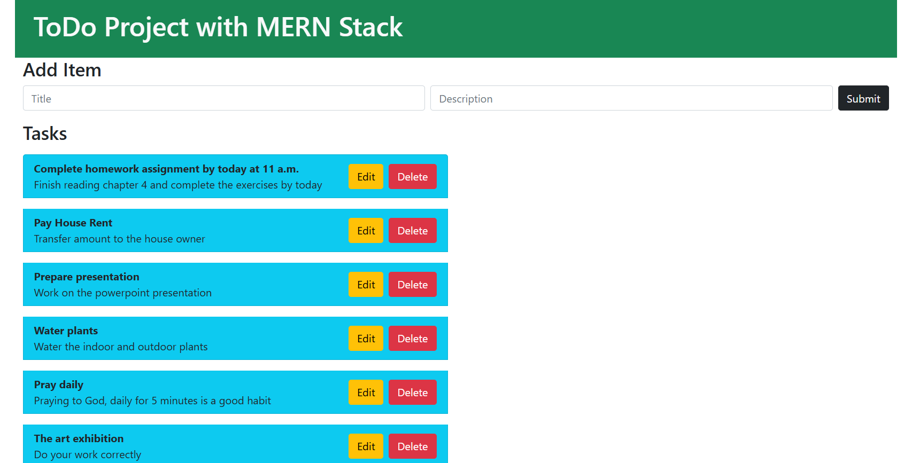

The project described is a **To-Do List Application** built using the
**MERN stack** (MongoDB, Express.js, React.js, Node.js). This project
takes a comprehensive, step-by-step approach to developing a full-stack
application, covering both backend and frontend implementations.

**Key Features and Workflow:**

**Backend (Server-Side Development)**

1.  **Set Up Development Environment**:

    -   Install necessary tools like Node.js, npm, and MongoDB.

    -   Configure your development environment for seamless MERN
        development.

2.  **Backend Setup**:

    -   Use **Express.js** to create a server with **Node.js**.

    -   Define routes and middleware to handle incoming requests.

3.  **Create Item API**:

    -   Implement a RESTful endpoint for creating new to-do items.

    -   Validate and structure incoming data.

4.  **Testing API with Postman**:

    -   Use Postman to test the endpoints, ensuring proper
        request-response cycles.

5.  **Get All Items API**:

    -   Create an endpoint to fetch all items from the database,
        returning them in a structured format.

6.  **MongoDB Integration**:

    -   Use **Mongoose** to define schemas and interact with the MongoDB
        database.

    -   Ensure efficient data storage and retrieval.

7.  **Connecting MongoDB**:

    -   Establish a connection between the Express server and MongoDB
        database using environment variables for secure access.

8.  **Handling Errors**:

    -   Add robust error-handling middleware to catch and respond to
        errors gracefully.

9.  **Update and Delete APIs**:

    -   Implement endpoints for updating and deleting specific to-do
        items.

    -   Use dynamic routes and database queries to manage the data
        efficiently.

**Frontend (Client-Side Development)**

1.  **Frontend Setup**:

    -   Initialize a React project using tools like create-react-app.

    -   Set up a clean project structure for components, pages, and
        assets.

2.  **Creating Item**:

    -   Build a form component to allow users to add new items.

    -   Handle form state and POST data to the backend API.

3.  **Fixing CORS Policy Error**:

    -   Configure the backend to allow cross-origin requests using
        middleware like cors.

4.  **Listing Items**:

    -   Fetch all items from the backend and display them in a list
        format.

    -   Use React state and hooks (useState, useEffect) for data
        management.

5.  **Edit & Update Item**:

    -   Provide an editable UI for users to modify existing items.

    -   Integrate PUT requests to update data in the backend.

6.  **Delete Item from the List**:

    -   Add functionality to delete items via the frontend.

    -   Confirm deletion actions for better UX.

**Final Testing**

-   Test the application end-to-end to ensure all functionalities work
    as intended.

-   Debug and optimize both client and server code for better
    performance.

